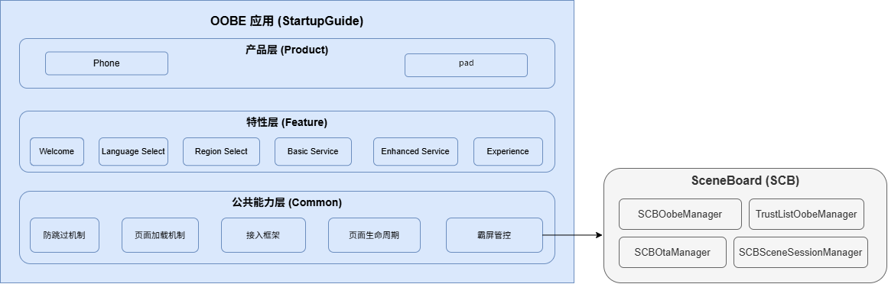
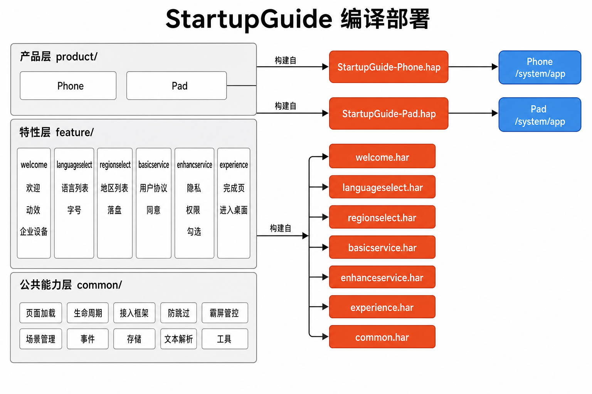

# StartupGuide

## 简介
**StartupGuide**（包名：`com.ohos.startupguide`）是 OpenHarmony 标准系统中的 **OOBE（Out Of Box Experience）开机引导系统应用**，为用户提供初次开机、恢复出厂设置、OTA 升级等场景下的初始设置引导流程。

本应用为系统预置应用，通常不在桌面显示图标。在 SceneBoard 模式下，由 SceneBoard（`SCBOobeManager`）按约定 bundleName 显式拉起；引导完成后进入系统桌面。

### 核心能力

**引导场景识别与页面编排**
- 通过 `SceneTypeManager` 在启动时识别当前场景：`FIRST_BOOT_SCENE`（初次开机 / 恢复出厂）或 `OTA_SCENE`（系统升级精简流程）。
- 由产品层 `PageOrderController` 按场景组装页面控制器链，驱动欢迎、语言、地区、协议、WLAN、立即体验等步骤顺序前进 / 回退。

**多语言与无障碍**
- 产品模块提供多 locale 资源，覆盖中、英语言。
- 通过 `RTLUtil` 与 `i18n.isRTL()` 支持从右到左布局。

**协议与隐私引导**
- 基础服务：最终用户许可协议 / 基础服务条款展示与同意。
- 增强服务：配置驱动的可选增强服务声明页，从oobe的配置文件配置展示哪些协议。从协议对应的业务应用的metadata读取协议内容，用户逐项勾选/取消，结果写入 Settings。
**外部页面接入**
- 通过 `ExternalPageComponent` / `BaseExternalPageController` 将 WLAN 等外部模块嵌入引导流程。
- 保持内部 Feature 与外部 Ability 之间的页面切换与返回语义一致。

> **说明**：本仓定位为 OOBE **应用层**。WLAN 等具体业务由 SceneBoard 及对应系统应用提供；本应用负责编排引导步骤、落盘用户选择，并在完成后交接给系统桌面。

### 支持的引导页面

| 页面 / PageKey | 所属模块 | 处理概要 |
| ---- | ------ | -------------- |
| WELCOME | welcome | 欢迎页、企业设备相关入口 |
| LANGUAGE_SELECT | languageselect | 语言选择、字号调节 |
| REGION_SELECT | regionselect | 国家 / 地区选择 |
| BASIC_SERVICE | basicservice | 基础服务条款 / 最终用户许可协议 |
| ENHANCED_SERVICE | enhanceservice | 配置驱动的可选增强服务声明页 |
| WLAN_KEY | product/phone（外部控制器） | WLAN 设置（外部页面） |
| EXPERIENCE_NOW | experience | 立即体验，完成引导进入桌面 |

### StartupGuide 与系统的关系

StartupGuide 依赖系统框架与多个系统应用协同，本身不实现 WLAN 等完整业务。

**事件与调用关系上**：
1. SceneBoard（`SCBOobeManager`）在需要开机引导时按 bundleName `com.ohos.startupguide` 显式拉起本应用的 `GuideHomeAbility`。
2. 本应用完成场景识别、页面编排与用户交互后，通过系统接口落盘设置并结束引导，交还桌面。
3. WLAN 等步骤通过外部页面控制器拉起对应系统应用 / Ability，再回到引导链。

> 例如，一次典型的初次开机流程：
> - SceneBoard 拉起 `GuideHomeAbility`；
> - `SceneTypeManager` 判定为 `FIRST_BOOT_SCENE`，`PageOrderController` 组装欢迎 → 语言 → 地区 → 基础服务 → 增强服务 → WLAN → 立即体验；
> - 用户完成最后一页后，进入系统桌面。

## 架构说明

StartupGuide 采用 **Product - Feature - Common** 三层架构，并与 SceneBoard、系统设置等协同工作。

### 在系统中的定位

StartupGuide 位于应用层，作为预置系统应用承接开机引导；由 SceneBoard 显式拉起，引导过程中可回调 WLAN 等系统能力，完成后进入桌面。



### 分层设计

StartupGuide 整体划分为产品层（Product）、特性层（Feature）、公共能力层（Common）：

- **产品层**：按设备形态组织入口 HAP，负责 Ability 生命周期、场景页面编排、形态 UI 定制与多语言资源。
- **特性层**：将欢迎、语言、地区、协议等引导步骤抽象为可复用 HAR，供不同产品形态按需集成。
- **公共能力层**：沉淀页面加载、页面生命周期、外部页面接入、防跳过与霸屏管控等跨特性基础能力，所有产品形态均需依赖。

### 模块化设计

StartupGuide 的模块化设计自底向上依次为公共能力层、特性层、产品层。

#### 1. 公共能力层

位于 `common` 目录，打包为 `@ohos/startupguide.common`。主要包含各产品形态打包时必须集成的引导基础能力，如页面编排、控制器基类、外部 Ability 接入、窗口管控、存储与通用 UI 等。

| 模块 | 路径 | 说明 |
| ---- | ---- | ---- |
| 页面加载机制 | `common/src/main/ets/manager/PageConfigManager.ets`<br>`common/src/main/ets/controller/BasePageOrderController.ets` | 解析 `page_configs` 与 CCM 配置，合并得到引导页顺序；按 `PageKey` 构建控制器链，支持前进 / 回退 / 跳转 |
| 页面生命周期 | `common/src/main/ets/controller/BasePageController.ets`<br>`common/src/main/ets/ability/AbstractGuideAbility.ets` | 单页控制器基类（初始化、数据加载、`isNeedShow`、上下页）；Guide Ability 公共生命周期与错误处理 |
| 接入框架 | `common/src/main/ets/controller/BaseExternalPageController.ets`<br>`common/src/main/ets/manager/WantManager.ts` | 外部系统页（如 WLAN）接入框架，定义 NEXT / PRE / SUBPAGE / CRASH 等结果码与 Want 协作 |
| 防跳过机制 | `common/src/main/ets/controller/BasePageOrderController.ets`<br>`common/src/main/ets/manager/FastCloneSceneManager.ets`<br>`common/src/main/ets/util/DeviceUtil.ets` | 按 `isNeedShow()` 过滤不可展示步骤；支持强制联网是否允许跳过、快速克隆场景跳页等策略 |
| 霸屏管控 | SCB 策略层：`SCBOobeManager.ts`<br>`BaseOobeManager.ts`<br>`trustlist/TrustListOobeManager.ts`<br>OOBE 执行层：`common/src/main/ets/manager/WindowManager.ets`<br>`product/phone/src/main/ets/ability/GuideHomeAbility.ets` | **SCB 策略层**：`SCBOobeManager.isOobeActivated()` 判定 OOBE 阶段状态，决定霸屏何时启用/解除；`TrustListOobeManager.isTrustlistForWms()` 白名单过滤允许 OOBE 阶段显示窗口的 UIAbility；`BaseOobeManager.startOobe()` 禁用边缘手势、注册会话异常监听，`finishOobe()` 恢复手势与取消监听。**OOBE 执行层**：`WindowManager.setWindowLayoutFullScreen()` + `maximize()` 全屏最大化；`setWindowSystemBarEnable()` 控制系统栏显示/隐藏；`setHideNonSystemFloatingWindows()` 隐藏非系统浮窗防诱导点击；`GuideHomeAbility` 在前台时持续隐藏浮窗、设置亮度为 1、禁用窗饰，切后台时恢复浮窗，降低恶意浮窗诱导风险 |
| 场景管理 | `common/src/main/ets/manager/SceneTypeManager.ets` | 识别初次开机、子用户等引导场景，驱动不同页面链与收尾写设置 |
| 事件系统 | `common/src/main/ets/event/` | `EventEmitter` / `EventReceiver` / 公共事件，支撑页面间解耦通信 |
| 数据持久化 | `common/src/main/ets/preferences/`<br>`common/src/main/ets/storage/` | 偏好设置与 KV 存储，落盘语言、地区、协议同意等引导结果 |
| 文本解析 | `common/src/main/ets/textparse/` | HTML / 粗体 / 链接等协议富文本解析（策略链） |
| 通用 UI 组件 | `common/src/main/ets/component/` | Footer、标题栏、富文本、Lottie、卡片网格、进入桌面等可复用组件 |
| 基础工具 | `common/src/main/ets/util/` | 日志、Want、Settings、配置解析、字号、结束引导（`OOBEUtil`）等工具方法 |

#### 2. 特性层

位于 `feature` 目录，主要包含跨产品可复用的引导特性能力。不同产品形态在打包时可按需集成相应特性。当前主要包括：

- **基础引导特性**：欢迎（`welcome`）、语言选择（`languageselect`）、地区选择（`regionselect`）、立即体验（`experience`）等。
- **协议与服务特性**：基础服务（`basicservice`）、增强服务（`enhanceservice`）、OTA 服务声明（`otaservice`）等。

| 模块 | 路径 | 说明 |
| ---- | ---- | ---- |
| 欢迎 | `feature/welcome` | 欢迎页布局与动效、企业设备离线触发等 |
| 语言选择 | `feature/languageselect` | 语言列表、语言/地区数据模型、字号调节 |
| 地区选择 | `feature/regionselect` | 国家/地区列表、选中结果落盘、地区工具 |
| 基础服务 | `feature/basicservice` | 基础服务条款 / 最终用户许可协议展示与同意；按版本决定是否展示 |
| 增强服务 | `feature/enhanceservice` | 从 JSON 加载可选增强服务声明项，用户勾选后落盘 Settings；含隐私组件（UIExtension）、权限弹窗、OTA 版本过滤 |
| 立即体验 | `feature/experience` | 引导完成页，结束 OOBE 并进入系统桌面 |

#### 3. 产品层

位于 `product` 目录，面向具体设备形态组织入口 HAP。当前提供 `phone` 产品形态；`Pad` 等形态可按同样分层方式扩展。产品层负责 Ability 入口、场景页面链组装、外部页面控制器，以及对特性组件的形态化封装与多语言资源。

| 模块 | 路径 | 说明 |
| ---- | ---- | ---- |
| AbilityStage | `product/phone/src/main/ets/Application/` | 应用级生命周期入口 |
| GuideHomeAbility | `product/phone/src/main/ets/ability/` | 引导主窗口 Ability；初始化编排、全屏/浮窗管控、船运模式协作 |
| 页面编排 | `product/phone/src/main/ets/controller/PageOrderController.ets` | 按场景组装欢迎 → 语言 → 地区 → 基础服务 → 增强服务 → WLAN → 立即体验等页面控制器链 |
| 外部页面控制器 | `product/phone/src/main/ets/controller/external/` | WLAN 等外部系统页接入与展示控制 |
| 主页面 / 页面模型 | `product/phone/src/main/ets/pages/`<br>`product/phone/src/main/ets/model/` | 引导主页面、重启提示页、页面切换模型与手机形态样式 |
| 形态组件封装 | `product/phone/src/main/ets/components/` | 对 Feature 组件做手机形态封装；含 `ExternalPageComponent` 等外部页容器 |
| 多语言资源 | `product/phone/src/main/resources/` | 产品侧多 locale 字符串与媒体资源 |

### Ability 与 UI 场景

入口 Ability 启动后完成场景初始化，由 `PageOrderController` 按场景拉起对应 Feature 页面，或经外部控制器嵌入系统页面：

**数据流概览**：

```text
SceneBoard (SCBOobeManager)
  → GuideHomeAbility
  → SceneTypeManager
  → PageOrderController
  → Feature PageController（welcome / language / ...）
  → 可选 ExternalPageController（WLAN 等）
  → ExperiencePageController
  → 进入系统桌面
```

**初次开机流程：**

```text
欢迎页 → 语言选择 → 地区选择 → 基础服务 → 增强服务 → WLAN → [外部页面...] → 立即体验
```

### 部件与外部依赖

部件内部按产品 / 特性 / 公共能力组织；跨进程协作依赖 SceneBoard 拉起、系统设置落盘，以及 WLAN 等外部 Ability。

```text
product/phone (entry)
├── @ohos/startupguide.common
├── @ohos/startupguide.basicservice
├── @ohos/startupguide.enhanceservice
├── @ohos/startupguide.languageselect
├── @ohos/startupguide.experience
├── @ohos/startupguide.welcome ──────── (depends on languageselect)
├── @ohos/startupguide.regionselect
└── @ohos/startupguide.otaservice ──── (depends on enhanceservice + basicservice)
```

## 编译构建

本工程为多模块 HAP 应用工程，使用 Hvigor 构建，入口模块为 `phone_startupguide`，产物为 `com.ohos.startupguide` 系统应用包，部署到设备 `/system/app`。



Release HAP 典型路径：

```text
product/phone/build/default/outputs/default/phone_startupguide-default-signed.hap
```

### 环境要求
- OpenHarmony SDK（本工程 `compileSdkVersion` 为 23，`compatibleSdkVersion` / `targetSdkVersion` 为 20）
- DevEco Studio 或命令行 Hvigor 工具链（建议使用 DevEco 自带 node / hvigor / JBR）
- Node.js 与 OHPM 包管理器
- 系统签名证书（见 `hw_sign/` / `signature/`）

### 编译命令

在工程根目录执行：

```bash
# 1. 安装依赖
ohpm install

# 2. 构建 HAP
hvigorw assembleHap

# 3. 运行测试（可选）
hvigorw @ohos/hypium:test
```

或使用 CI/CD 脚本：

```bash
sh build.sh
```

若作为 OpenHarmony 系统部件合入源码树，可参考平台统一构建方式，将本应用作为预置系统应用打包进镜像。

### 关键依赖

| 依赖 | 版本 | 说明 |
| ---- | ---- | ---- |
| `@ohos/lottie` | 2.0.27 | Lottie 动画库 |
| `@ohos/hypium` | 1.0.21 | 测试框架 |

> 部分 HMS / AppGallery 依赖可能按产品形态裁剪或注释，合入目标以实际产品依赖清单为准。

## StartupGuide 开发

StartupGuide 采用 **ArkTS** 语言开发，UI 基于 ArkUI Stage 模型。产品层负责 Ability 与页面编排，Feature 层承载各引导步骤业务，Common 层提供共享基础能力。可开发参考：[ArkUI 开发概述](https://gitcode.com/openharmony/docs/blob/master/zh-cn/application-dev/ui/arkts-ui-development-overview.md)

### 基于已有模块的开发

适用场景：对已有引导步骤做功能定制，例如调整页面顺序、裁剪某一步、修改协议文案交互、调整外部页面接入等。

**对已有模块的功能调整与裁剪**

1. 明确改动落点：按业务边界定位到 `product/phone`（编排 / 形态）、`feature/*`（单步业务）或 `common`（场景、基类、工具）。
2. 调整页面顺序或场景时：
    - 场景判断位于 `common/.../manager/SceneTypeManager.ets`；
    - 页面键定义位于 `common/.../constant/PageKey.ts`；
    - 场景页面链组装位于 `product/phone/.../controller/PageOrderController.ets`。
3. 裁剪某引导步骤时：
    - 先在 `PageOrderController` 对应场景 Map 中移除该 `PageKey`；
    - 再确认无残留跳转、埋点与测试依赖，避免断链。

例如，初次开机场景的页面链注册如下（摘自 `PageOrderController.ets`）。若要裁剪某一页，删除对应 `mControllerMap.set(...)` 即可：

```typescript
// product/phone/src/main/ets/controller/PageOrderController.ets
private initFirstBootSceneMap(): void {
  let firstController: BasePageController = new WelcomePageController(this, PageKey.WELCOME);
  FirstDefaultPageManager.getInstance().setDefaultFirstPage(PageKey.WELCOME, firstController);
  this.mControllerMap.set(PageKey.WELCOME, firstController);
  this.mControllerMap.set(PageKey.LANGUAGE_SELECT, new LanguageSelectPageController(this));
  this.mControllerMap.set(PageKey.REGION_SELECT, new RegionSelectPageController(this));
  this.mControllerMap.set(PageKey.BASIC_SERVICE, new BasicServicePageController(this));
  this.mControllerMap.set(PageKey.ENHANCED_SERVICE, new EnhanceServicePageController(this));
  this.mControllerMap.set(PageKey.WLAN_KEY, new WlanPageController(this));
  this.mControllerMap.set(PageKey.EXPERIENCE_NOW, new ExperiencePageController(this));
}
```

外部页是否展示，由控制器重写 `isNeedShow()` 决定。以 WLAN 为例（摘自 `WlanPageController.ets`）：

```typescript
// product/phone/src/main/ets/controller/external/WlanPageController.ets
export class WlanPageController extends BaseExternalPageController {
  public constructor(pageOrderController: IPageOrderController) {
    super(pageOrderController, PageKey.WLAN_KEY);
  }

  isNeedShow(): boolean {
    if (FastCloneSceneManager.getInstance().isCloneWlan()) {
      let isNetConnected: boolean = InternetManager.getInstance().isNetConnected();
      return super.isNeedShow() && !isNetConnected;
    }
    return super.isNeedShow();
  }
}
```

**对已有 UI 进行修改**

以定制初次开机欢迎页界面举例：
- 应用入口为 `GuideHomeAbility`，页面编排为 `PageOrderController`。
- Feature 层提供页面控制器与可复用业务组件；产品层可在 `product/phone/src/main/ets/components/` 做形态定制封装。
- 开发过程中优先在对应 Feature 内扩展，避免把产品形态差异泄漏到 Common。

产品侧欢迎页封装示例如下（摘自 `WelcomeComponent.ets`），通过 `WelcomeComp` 组合 Feature 组件并处理继续按钮：

```typescript
// product/phone/src/main/ets/components/welcome/WelcomeComponent.ets
@Builder
export function WelcomeComponentLoader($$: IPageController | null | undefined): void {
  WelcomeComponent({ mPageController: $$ as WelcomePageController });
}

@Component
export struct WelcomeComponent {
  protected mPageController: WelcomePageController | null = null;

  build() {
    WelcomeComp({
      firstSrcPath: '',
      secondSrcPath: '',
      yHeight: '86.0%',
      isAutoPlaySecond: false,
      accessibilityReadingText: ResourceUtil.getStringByResource($r('app.string.continue')),
      buttonOnClick: () => {
        if (!StringUtil.isFastClick()) {
          this.mPageController?.handleNextButtonClick();
        }
      }
    })
  }
}
```

常用修改入口：

| 目标 | 路径 |
| ---- | ---- |
| 场景识别 | `common/src/main/ets/manager/SceneTypeManager.ets` |
| 页面键 | `common/src/main/ets/constant/PageKey.ts` |
| 页面编排 | `product/phone/src/main/ets/controller/PageOrderController.ets` |
| 欢迎 / 语言 / 地区等业务 | `feature/<module>/` |
| 外部页面（如 WLAN） | `product/phone/src/main/ets/controller/external/` |
| 产品形态组件封装 | `product/phone/src/main/ets/components/` |

### 新特性或引导步骤的开发

适用场景：新增引导页面、扩展设备形态、补充外部系统页面接入。

> **说明**：当前工程以 `product/phone` 作为入口 HAP，Feature 以 HAR 形式复用。新能力优先落在独立 Feature HAR；仅当能力需跨特性复用时再下沉到 `common`。

**步骤1：扩展页面编排（最常见）**

1. 在 `PageKey.ts` 中补充新的页面键（如已存在则跳过）：

```typescript
// common/src/main/ets/constant/PageKey.ts
export enum PageKey {
  WELCOME = 'welcome',
  LANGUAGE_SELECT = 'language_select',
  REGION_SELECT = 'region_select',
  BASIC_SERVICE = 'basic_service_statement',
  ENHANCED_SERVICE = 'enhanced_service_statement',
  EXPERIENCE_NOW = 'experience',
  WLAN_KEY = 'wlan',
  // 新增页面键示例：
  // MY_NEW_PAGE = 'my_new_page',
}
```

2. 在 `feature/` 下新增或扩展对应 HAR（Controller + Component + Model）。Feature 控制器通常继承 `BasePageController`，例如欢迎页：

```typescript
// feature/welcome/src/main/ets/controller/WelcomePageController.ets
export class WelcomePageController extends BasePageController {
  public constructor(pageOrderController: IPageOrderController, controllerKey: PageKey) {
    super(pageOrderController, controllerKey);
  }
}
```

3. 在 `PageOrderController` 的场景 Map 中注册该控制器（参见上文 `initFirstBootSceneMap`）。
4. 如需外部系统页面，继承 `BaseExternalPageController` 并在产品层注册（参见上文 `WlanPageController`）。
5. 在 `product/phone/src/ohosTest` 中补充对应 DT 用例。

**步骤2：配置 / 确认 Ability 入口**

本工程入口已在 `product/phone/src/main/module.json5` 中声明。SceneBoard 模式下不要注册 `entity.system.home` / `action.system.home`，避免抢占开机 home 槽位。扩展能力时通常只需确认权限、`deviceTypes` 与 Ability 配置是否满足新场景：

```json
{
  "module": {
    "name": "phone_startupguide",
    "type": "entry",
    "srcEntrance": "./ets/Application/AbilityStage.ets",
    "mainElement": "com.ohos.startupguide.MainAbility",
    "deviceTypes": [
      "default"
    ],
    "abilities": [
      {
        "name": "com.ohos.startupguide.MainAbility",
        "srcEntry": "./ets/ability/GuideHomeAbility.ets",
        "visible": false
      }
    ]
  }
}
```

入口 Ability 在窗口创建时初始化页面编排并加载引导主页面（摘自 `GuideHomeAbility.ets`）：

```typescript
// product/phone/src/main/ets/ability/GuideHomeAbility.ets
export default class GuideHomeAbility extends AbstractGuideAbility {
  onWindowStageCreate(windowStage: window.WindowStage): void {
    Promise.all([
      PageOrderController.getInstance().init(() => {
        ExperienceManager.getInstance().setLightModeOnRestart();
      }),
      mediaConfigManager.initMediaConfig(),
      pageLayoutManager.initPageLayoutConfig()
    ]).finally(() => {
      this.loadContent(windowStage, 'pages/Page');
    });
    WindowManager.getInstance().registerWindowStage(windowStage);
  }

  loadWindowStage(windowStage: window.WindowStage, pageUrl: string) {
    windowStage?.loadContent(pageUrl).then(() => {
      windowStage.getMainWindow().then((mainWindow) => {
        mainWindow.setWindowBrightness(1);
        WindowManager.getInstance().setWindowLayoutFullScreen(true);
        WindowManager.getInstance().setHideNonSystemFloatingWindows(true);
        windowStage.disableWindowDecor();
      });
    });
  }
}
```

**步骤3：定制 UI**

在完成页面注册与编排后，按上一节「对已有 UI 进行修改」扩展对应 Feature 组件即可。

若需新增独立页面：
1. 在对应 `feature/<module>/` 或 `product/phone/src/main/ets/pages/` 下新增页面 / 组件；
2. 在 `resources/base/profile/main_pages.json` 中注册（如需要）；
3. 由 `PageOrderController` 按 `PageKey` 拉起。

## 目录
```text
StartupGuide
├─AppScope                              # 应用级配置与图标资源
│  ├─app.json5                          # bundleName、版本号等
│  └─resources/                         # 应用级资源
├─common                                # Common 层 - 共享基础库
│  └─src/main/ets/
│     ├─ability/                        # 基础 Ability 类
│     ├─component/                      # 可复用 UI 组件
│     ├─constant/                       # PageKey、CommonConstant 等
│     ├─context/                        # GlobalContext、RealContext
│     ├─controller/                     # 页面 / 外部页面基类控制器
│     ├─event/                          # EventEmitter / EventReceiver
│     ├─manager/                        # 场景、船运模式等管理器
│     ├─model/                          # 公共数据模型
│     ├─preferences/                    # 偏好设置
│     ├─storage/                        # KV 存储
│     ├─textparse/                      # HTML / 粗体 / 链接解析
│     └─util/                           # 工具类
├─feature                               # Feature 层 - 独立特性 HAR
│  ├─basicservice/                      # 基础服务 / 用户协议
│  ├─enhanceservice/                    # 增强服务
│  ├─experience/                        # 立即体验
│  ├─languageselect/                    # 语言选择
│  ├─otaservice/                        # OTA 服务声明
│  ├─regionselect/                      # 国家 / 地区选择
│  └─welcome/                           # 欢迎页 / 企业设备
├─product                               # Product 层 - 设备形态入口
│  └─phone/                             # 手机产品形态（entry HAP）
│     ├─src/main/ets/                   # Ability、编排、外部控制器、形态组件
│     ├─src/main/resources/             # 多语言资源
│     └─src/ohosTest/                   # Hypium DT 测试
├─hvigor                                # 构建工具配置
├─hw_sign / signature                   # 签名证书与 profile
├─build-profile.json5                   # 工程级 SDK / 签名 / modules 配置
├─build.sh                              # CI/CD 构建脚本
├─hvigorfile.ts                         # Hvigor 构建入口
├─oh-package.json5
├─OAT.xml                               # 开源合规审计
├─LICENSE
├─README.md
└─README_en.md
```

## 约束
- 语言版本：ArkTS
- 运行形态：系统预置应用（`com.ohos.startupguide`），依赖系统特权权限与 SceneBoard 显式拉起
- 设备类型：当前入口模块 `deviceTypes` 为 `default`（见 `product/phone/src/main/module.json5`）
- SDK：`compileSdkVersion` 23，`compatibleSdkVersion` / `targetSdkVersion` 20；应用 `minAPIVersion` 11、`targetAPIVersion` 12
- SceneBoard 模式：勿将本应用注册为系统桌面（`entity.system.home`），否则可能抢占开机 home 槽位
- 系统应用所需高权限不能仅按“最小权限”原则直接删除，需核对真实场景、`usedScene`、调用方与预装身份
- 本仓不包含 SceneBoard / WLAN 等外部系统应用源码；外部步骤通过控制器与 IPC / Ability 拉起协作

## 参与贡献

欢迎广大开发者贡献代码、文档等，具体的贡献流程和方式请参见[参与贡献](https://gitcode.com/openharmony/docs/blob/master/zh-cn/contribute/%E5%8F%82%E4%B8%8E%E8%B4%A1%E7%8C%AE.md)。

## 相关仓
- [Scene Board](https://gitcode.com/openharmony/window_scene_board)