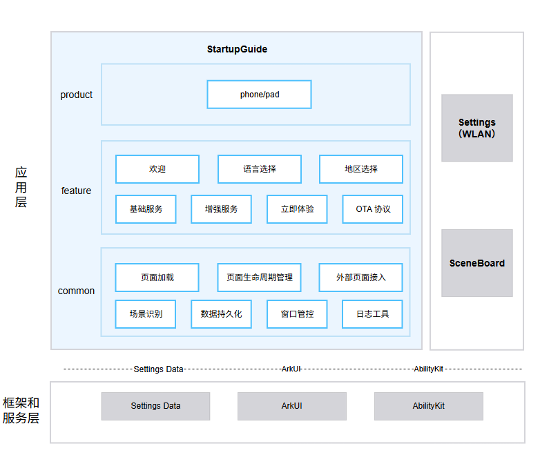
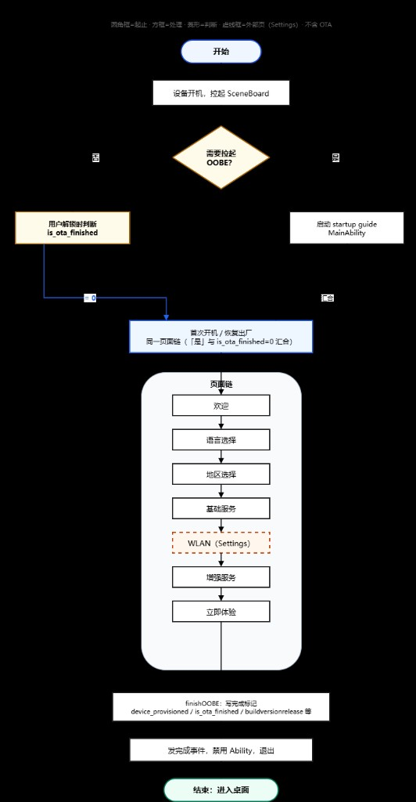

# startup guide

## 简介

**startup guide**（包名：`com.ohos.startup_guide`）是 OpenHarmony 标准系统中的 **OOBE（Out Of Box Experience）开机引导系统应用**，负责在初次开机、恢复出厂设置场景中完成初始设置引导。

本应用为系统预置应用，不在桌面显示图标。设备启动时，系统会先拉起 SceneBoard（SCB）进程——SceneBoard 是窗口子系统中的系统级桌面进程，负责桌面、锁屏、壁纸等系统 UI，并管理屏幕与窗口；启动后由其 `SCBOobeManager` 根据 OOBE 标记位判断是否需要拉起开机引导。若需要引导，则按约定显式启动 `com.ohos.startup_guide.MainAbility`（实现类为 `GuideHomeAbility`）。引导完成后，startup guide 写入完成状态并进入系统桌面。当前仓库提供 phone、Pad 入口。

### 核心能力

**引导场景识别**
- 查询 settingsData 数据库中 OOBE 的标记位，区分初次开机和恢复出厂
- 预置场景：SceneBoard 启动后读取 OOBE 标记位，判断是否拉起 OOBE。`device_provisioned` 为 0 或不存在时，会拉起 OOBE，走开机或恢复出厂流程；流程结束后将 `device_provisioned` 设为 1
- OTA 场景：`is_ota_finished` 为 0 时进入恢复出厂 OOBE；不为 0 时，再根据 `buildversionrelease` 判断版本号。若有协议变更，则展示对应页面（基础服务变更展示基础服务，增强服务变更展示增强服务）

| 字段 | device_provisioned | is_ota_finished |
| ---- | ---- | ---- |
| 标记位含义 | 设备是否已经完成激活 | 标识是否OTA未完成场景 |
| 数据库中的表名 | (设备级) SETTINGSDATA | (用户级) USER_SETTINGSDATA_SECURE_XXX |

**欢迎:** 展示开机欢迎界面，引导用户开始初始设置。

**语言选择:** 让用户挑选系统要用的语言；选好以后，后面的引导页面都会按这种语言显示。

**国家地区选择:** 供用户选择所在国家或地区，为后续系统服务提供区域信息。

**基础服务条款:** 展示最终用户许可协议和基础服务条款，并保存用户的同意状态。

**增强服务:** 根据配置展示可选的增强服务协议，并保存用户的选择结果。

**立即体验**
- 完成 OOBE 引导，保存完成状态并进入系统桌面。

### 支持的引导页面

| 页面 / PageKey                | 所属模块 | 场景与处理概要 |
|-----------------------------| ---- | ---- |
| `WELCOME`                   | `feature/welcome` | 欢迎页及企业设备相关处理 |
| `LANGUAGE_SELECT`           | `feature/languageselect` | 语言选择 |
| `REGION_SELECT`             | `feature/regionselect` | 国家 / 地区选择 |
| `BASIC_SERVICE`             | `feature/basicservice` | 基础服务条款 / 最终用户许可协议 |
| `ENHANCED_SERVICE`          | `feature/enhanceservice` | 增强服务声明 |
| `LOADING`                   | `feature/otaservice` | OTA 场景加载页 |
| `SERVICE_CHANGED_STATEMENT` | `feature/otaservice` | OTA 协议变更展示（体现协议能力） |
| `WLAN_KEY`                  | `product/phone` 外部控制器 | 连接网络页面 |
| `EXPERIENCE_NOW`            | `feature/experience` | 完成引导并进入桌面 |

## 架构说明

startup guide 采用 **Product - Feature - Common** 三层模块化架构，并与 SceneBoard、Settings（含 WLAN OOBE 扩展页）等系统部件协同工作。

### 在系统中的定位

startup guide 位于应用层，由 SceneBoard 显式拉起；引导过程中通过系统框架完成 UI、Ability、窗口和数据访问，并按需接入 WLAN 页面、读写系统设置。





### 应用层分层设计

整体可划分为产品层、特性层、公共层：

| 层次 | 主要目录 / 组件 | 说明                                                     |
| ---- | ---- |--------------------------------------------------------|
| 产品层 | `product` | 支持手机、平板形态；承载 `GuideHomeAbility`、页面链组装、外部页面控制器及产品形态组件封装 |
| 特性层 | `feature/welcome`、`feature/languageselect`、`feature/regionselect`、`feature/basicservice`、`feature/enhanceservice`、`feature/experience`、`feature/otaservice` | 欢迎、语言选择、地区选择、基础服务、增强服务、立即体验、OTA 协议能力 |
| 公共层 | `common` | 页面加载、页面生命周期管理、外部页接入、场景识别、Preferences 等数据持久化、窗口管控、日志工具 |

**特性层模块说明：**

| 核心能力 | 模块 | 说明 |
| ---- | ---- | ---- |
| 欢迎 | `WelcomePageController`（welcome） | 展示开机欢迎界面，引导用户开始初始设置 |
| 语言选择 | `LanguageSelectPageController`（languageselect） | 让用户挑选系统要用的语言；选好以后，后面的引导页面都会按这种语言显示 |
| 地区选择 | `RegionSelectPageController`（regionselect） | 供用户选择所在国家或地区，为后续系统服务提供区域信息 |
| 基础服务 | `BasicServicePageController`（basicservice） | 展示最终用户许可协议及基础服务条款，并保存用户同意状态 |
| 增强服务 | `EnhanceServicePageController`（enhanceservice） | 根据配置展示可选增强服务协议，并保存用户勾选结果 |
| 立即体验 | `ExperiencePageController`（experience） | 完成 OOBE 引导，保存完成状态并进入系统桌面 |
| OTA 协议 | `LoadingPageController` 等（otaservice） | OTA 场景下的协议能力：加载页、协议版本比对与变更展示；原 upgradeguide 中必要能力归并至此 |

### 与其他应用的关系

|维度| 说明 |
|-------------| ---- |
| 是否允许其他应用调用  | 允许。入口 Ability `com.ohos.startup_guide.MainAbility`（`GuideHomeAbility`）声明 `exported=true`，由系统侧显式拉起 |
| 谁能调用        | SceneBoard 通过 `SCBOobeManager` 拉起 OOBE；Settings 提供 WLAN OOBE 扩展页 `OobeWifiSettingsExtensionAbility`，由 startup guide 经外部页接入框架拉起 |
| 什么时候能调用     | 初次开机、恢复出厂设置等需要开机引导时，由 SceneBoard 拉起；WLAN 步骤在引导页面链执行到网络配置时接入 |
| 支持的 Want 参数 | SceneBoard 按约定 bundleName `com.ohos.startup_guide` 显式启动 `MainAbility`；WLAN 外部页通过页面配置中的 bundleName / abilityName / UIExtension 参数接入 |
| 跨进程服务       | 语言、地区、协议同意和 OOBE 完成状态通过 Settings Data 读写；界面依赖 ArkUI，Ability 生命周期与扩展能力依赖 AbilityKit；引导完成后更新 `device_provisioned` 并交还系统桌面 |

## 编译构建

本工程为单 HAP 多模块应用工程，使用 Hvigor 构建。入口模块为 `phone_startupguide`。

### 环境要求

- OpenHarmony SDK: compileSdkVersion 26.0.0, compatibleSdkVersion 23, targetSdkVersion 23
- DevEco Studio 或命令行 Hvigor 工具链
- Node.js 与 OHPM

### 编译命令

在工程根目录执行：

```bash
sh build.sh
```

### 构建产物

| 类型 | 产物 / 目标 | 说明 |
| ---- | ---- | ---- |
| 签名 HAP | `product/phone/build/default/outputs/default/phone_startupguide-default-signed.hap` | 可安装的默认签名产物 |

## startup guide 开发

startup guide 使用 **ArkTS** 开发。产品层负责入口与页面编排，Feature 层承载独立特性，Common 层提供跨特性基础能力。

### 基于已有模块的开发

适用场景：裁剪引导步骤、修改协议交互、调整外部页面接入或定制产品形态 UI。

**1. 确认改动层次**
- Ability 和形态适配：`product/phone`
- 单个引导步骤业务：`feature/<module>`
- 页面基类、场景、存储和通用能力：`common`

**2. 调整外部页面显示和隐藏**

外部页面控制器继承 `BaseExternalPageController`。以 WLAN 为例：

```typescript
export class WlanPageController extends BaseExternalPageController {
  isNeedShow(): boolean {
    if (FastCloneSceneManager.getInstance().isCloneWlan()) {
      let isNetConnected =
        InternetManager.getInstance().isNetConnected();
      return super.isNeedShow() && !isNetConnected;
    }
    return super.isNeedShow();
  }
}
```

**3. 调整增强服务协议**

- 展示项配置：`product/phone/src/main/resources/rawfile/enhance_service_statements.json`
- 协议实体生成：`common/src/main/ets/util/ServiceEntityUtil.ets`
- 页面控制器：`feature/enhanceservice/src/main/ets/controller/EnhanceServicePageController.ets`
- 状态保存：`feature/enhanceservice/src/main/ets/util/EnhanceServiceUtil.ets`

#### 协议接入 OOBE 指导

#### 基础协议（协议与声明）

用户必须同意后方可使用手机的基础协议。

在 `basic_service_statements.json` 配置文件中添加对应的基础服务声明配置。

- 手机产品路径：`product/phone/src/main/resources/rawfile/basic_service_statements.json`
- 针对基础协议页面，需在 `product/phone/src/main/resources/rawfile/html/endUserSoftwareLicense/` 对应语言目录下修改 HTML 文件中的更新日期、协议内容及版本号

**配置示例（基础协议）**

```json
[
  {
    "serviceType": "basic",
    "serviceName": "test_basic_statement",
    "moduleName": "entry",
    "packageName": "com.example.teststartupguide",
    "validatorList": [],
    "checkboxList": ["settings=test_basic_status"],
    "saveDataList": ["settings=test_basic_status"]
  }
]
```

#### 增强协议（增强服务与用户体验改进）

用户可选的协议，支持逐项勾选。

在 `enhance_service_statements.json` 配置文件中添加对应的增强服务声明配置。

- 手机产品路径：`product/phone/src/main/resources/rawfile/enhance_service_statements.json`
- 在业务方代码仓中配置声明资源，包括协议版本号、标题、协议内容及参数等信息

**配置示例（增强协议）**

```json
[
  {
    "serviceType": "enhance",
    "serviceName": "test_enhance_statement",
    "moduleName": "entry",
    "packageName": "com.example.teststartupguide",
    "validatorList": [],
    "checkboxList": ["settings=test_enhance_status"],
    "saveDataList": ["settings=test_enhance_status"]
  }
]
```

**配置参数说明**

| 参数名 | 说明 | 示例 |
| ---- | ---- | ---- |
| `serviceType` | 必填。协议类型，`"basic"` 表示基础协议，`"enhance"` 表示增强协议，其他值无效 | `"basic"` |
| `serviceName` | 必填。业务接入方 metadata 中的 name 值 | `"test_enhance_statement"` |
| `moduleName` | 必填。业务接入方 metadata 所属的模块名 | `"entry"` |
| `packageName` | 必填。业务接入方包名 | `"com.example.teststartupguide"` |
| `validatorList` | 可选。显示控制字段，用于指定是否显示的判断条件，支持 SysParameter、SettingsData、Custom 三种方式 | `["sysparameter=const.xxx.yyy=zzz"]` |
| `checkboxList` | 可选。历史选中状态，主要用于 OTA 升级场景中判断历史勾选状态。该字段需为 `saveDataList` 的子集，可配置一个字段。指定表名示例：`["settings=xxx, test_enhance_status"]`；不指定表名示例：`["settings=test_enhance_status"]`（默认存储于 global 表，与底层 settings 行为保持一致） | `["settings=test_enhance_status"]` |
| `saveDataList` | 可选。存储 settings 数据，可配置多个字段。存储值为 1 表示勾选，0 表示未勾选。指定表名示例：`["settings=xxx, test_enhance_status"]`；不指定表名示例：`["settings=test_enhance_status"]`（默认存储于 global 表） | `["settings=test_enhance_status"]` |
| `defaultCheckStatus` | 可选。首次进入页面时的默认开关状态，默认为开启（true），如需默认关闭可配置为 false | `false` |

**业务侧代码修改**

**1. 配置 metadata 信息**

在业务侧代码中配置与开机向导对应的 metadata 信息，样例如下（请根据实际框架补充）。

**2. 配置服务声明内容 JSON 文件**

```json
{
  "version": "1.0",
  "title": "$string:statement_test_title",
  "content": "$string:statement_test_content",
  "params": [
    {
      "name": "param1",
      "value": "我的"
    },
    {
      "name": "param2",
      "value": "$string:param_value_2"
    }
  ],
  "abilities": [
    {
      "key": "测试",
      "value": {
        "bundleName": "com.example.teststartupguide",
        "abilityName": "EntryAbility",
        "parameters": {
          "ability.want.params.uiExtensionType": "您的type",
          "msg": "测试"
        }
      }
    },
    {
      "key": "r",
      "value": {
        "bundleName": "com.example.teststartupguide",
        "abilityName": "EntryAbility",
        "parameters": {
          "ability.want.params.uiExtensionType": "sys/commonUI"
        }
      }
    }
  ],
  "appLists": [
    {
      "name": "xxxxx",
      "content": "xxxxxxx",
      "key": "xxxxx"
    }
  ]
}
```

**常用修改入口：**

| 目标 | 路径 |
| ---- | ---- |
| 场景识别 | `common/src/main/ets/manager/SceneTypeManager.ets` |
| 页面键 | `common/src/main/ets/constant/PageKey.ts` |
| 页面编排 | `product/phone/src/main/ets/controller/PageOrderController.ets` |
| 外部页面 | `product/phone/src/main/ets/controller/external/` |
| 产品组件 | `product/phone/src/main/ets/components/` |
| 页面配置 | `product/phone/src/main/resources/rawfile/page_configs.json` |
| 协议配置 | `product/phone/src/main/resources/rawfile/*service_statements.json` |
| 主入口 | `product/phone/src/main/ets/ability/GuideHomeAbility.ets` |

### 新特性或引导步骤开发

适用场景：新增引导页面、扩展协议类型或接入新的外部系统页面。

**步骤 1：定义页面键和控制器**
1. 在 `PageKey.ts` 中新增唯一页面键。
2. 在对应 `feature/<module>` 中创建继承 `BasePageController` 的控制器。
3. 在 `PageOrderController` 的目标场景 Map 中注册控制器。

**步骤 2：实现并接入 UI**
1. 在 Feature 中实现可复用 Component / Model。
2. 在 `product/phone/src/main/ets/components/` 中增加必要的产品形态封装。

**步骤 3：接入外部系统页面**
1. 继承 `BaseExternalPageController`。
2. 在页面配置中声明目标 bundleName、abilityName、参数及返回语义。
3. 校验 NEXT、PRE、SUBPAGE、CRASH 等返回路径。
4. 实现对应方法，如：`isNeedShow()` 控制页面显隐、跳转下一页等。

**步骤 4：配置入口与权限**

入口已在 `product/phone/src/main/module.json5` 中声明：

```json
{
  "module": {
    "name": "phone_startupguide",
    "type": "entry",
    "srcEntrance": "./ets/Application/AbilityStage.ets",
    "mainElement": "com.ohos.startup_guide.MainAbility",
    "deviceTypes": ["default"]
  }
}
```

**步骤 5：测试**
- 在 `product/phone/src/ohosTest/` 增加页面控制器、组件和工具类测试。
- 覆盖前进、返回、跳过和外部页面异常等路径。
- 在目标 Phone / Pad 产品形态上验证布局、旋转和语言表现。

## 目录

```text
startup guide
├─AppScope
│  ├─app.json5                          # bundleName、版本与应用级配置
│  └─resources/                         # 应用图标与全局资源
├─common                                # Common 层共享 HAR
│  └─src/main/ets/
│     ├─ability/                        # AbstractGuideAbility
│     ├─component/                      # 通用 UI 组件
│     ├─constant/                       # PageKey、CommonConstant
│     ├─context/                        # 公共上下文封装
│     ├─controller/                     # 页面与外部页面控制器基类
│     ├─event/                          # 页面间事件
│     ├─manager/                        # 场景、页面、媒体、窗口等管理器
│     ├─model/                          # 页面配置、服务声明、布局样式等公共模型
│     ├─preferences/                    # Preferences 封装（协议勾选、场景标记等本地持久化）
│     ├─storage/                        # KV 存储
│     ├─textparse/                      # 协议富文本解析
│     ├─timer/                          # 定时器抽象与实现
│     └─util/                           # Settings、资源、Want 等工具
├─feature                               # Feature 层独立 HAR
│  ├─basicservice/                      # 基础服务协议
│  ├─enhanceservice/                    # 增强服务协议
│  ├─experience/                        # 立即体验
│  ├─languageselect/                    # 语言与字号
│  ├─otaservice/                        # OTA 协议能力（加载页、协议变更等）
│  ├─regionselect/                      # 国家 / 地区
│  └─welcome/                           # 欢迎页
├─product
│  └─phone/                             # 当前 entry HAP
│     ├─src/main/ets/                   # Ability、编排、组件与模型
│     ├─src/main/resources/             # 页面配置、协议配置和多语言资源
├─docs
│  └─figures/
│     ├─oobe_architecture.png            # startup guide 中文分层架构图
│     └─oobe_architecture_en.png         # startup guide 英文分层架构图
├─hvigor                                # Hvigor 配置
├─build.sh                              # 构建脚本
├─hvigorfile.ts                         # Hvigor 构建入口
├─README.md                             # 中文文档
└─README_en.md                          # 英文文档
```

其中，`common/src/main/ets/model/` 集中定义页面配置、服务声明、布局样式及通用数据结构，供 Product 层和各 Feature 模块复用。

## 约束

- **语言**：使用 ArkTS 语言。
- **设备类型**：手机、平板。

## 参与贡献

欢迎广大开发者贡献代码和文档，具体流程请参见 OpenHarmony [参与贡献](https://gitcode.com/openharmony/docs/blob/master/zh-cn/contribute/%E5%8F%82%E4%B8%8E%E8%B4%A1%E7%8C%AE.md)。

## 相关仓

- [window_scene_board](https://gitcode.com/openharmony/window_scene_board)（SceneBoard 启动与窗口场景协同）
- [applications_settings](https://gitcode.com/openharmony/applications_settings)（系统设置与相关外部页面）
