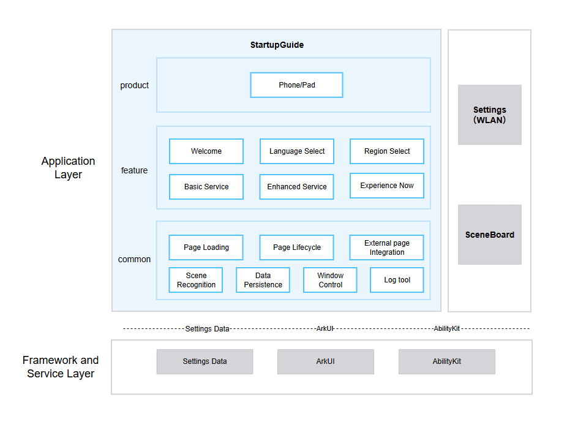

# StartupGuide

## Introduction

**StartupGuide** (bundle name: `com.ohos.startupguide`) is the **OOBE (Out Of Box Experience) startup guide system application** in the OpenHarmony standard system. It guides users through initial setup during first boot and factory reset.

This application is pre-installed by the system and does not display an icon on the desktop. In the SceneBoard process, `SCBOobeManager` explicitly starts `com.ohos.startupguide.MainAbility` through the agreed BaseOOBEManager mechanism; the implementation class of this Ability is `GuideHomeAbility`. After the guide is complete, StartupGuide writes the completion state and enters the system desktop. This repository currently provides Phone and Pad entry points.

### Core Capabilities

**Welcome**
- Displays the startup welcome screen and guides users to begin initial setup.

**Language Selection**
- Allows users to select the system display language and applies it to subsequent guide pages.

**Country or Region Selection**
- Allows users to select their country or region for subsequent system services.

**Basic Service Terms**
- Displays the End User License Agreement and basic service terms, and saves the user's consent state.

**Enhanced Services**
- Displays optional enhanced service agreements based on configuration and saves the user's selections.

**Experience Now**
- Completes the OOBE guide, saves the completion state, and enters the system desktop.

### Supported Guide Pages

| Page / PageKey | Module | Scenario and Handling Summary |
| ---- | ---- | ---- |
| `WELCOME` | `feature/welcome` | Welcome page and enterprise-device-related handling |
| `LANGUAGE_SELECT` | `feature/languageselect` | Language selection |
| `REGION_SELECT` | `feature/regionselect` | Country / region selection |
| `BASIC_SERVICE` | `feature/basicservice` | Basic service terms / End User License Agreement |
| `ENHANCED_SERVICE` | `feature/enhanceservice` | Enhanced service statements |
| `WLAN_KEY` | External controller in `product/phone` | Network connection page |
| `EXPERIENCE_NOW` | `feature/experience` | Completes the guide and enters the desktop |

## Architecture

StartupGuide uses a three-layer **Product - Feature - Common** modular architecture and collaborates with system components such as SceneBoard and Settings (including the WLAN OOBE extension page).

### Position in the System

StartupGuide resides in the application layer and is explicitly started by SceneBoard. During the guide, it uses system frameworks for UI, Ability, window, and data access, integrates the WLAN page as needed, and reads or writes system settings.



The system applications on the right side of the figure are consistent with the preceding description:
- **SceneBoard**: Starts OOBE and restricts other application windows during the guide, ensuring that the startup guide always remains in the foreground.
- **Settings (WLAN)**: Provides the WLAN OOBE extension page and hosts related system configuration.
- **Settings / DataShare**: Provides data read and write capabilities.

### Relationship Between StartupGuide and Other System Applications

StartupGuide collaborates with SceneBoard and Settings (including the WLAN OOBE extension page) shown on the right side of the system positioning diagram, but does not contain the complete business implementations of these components.

**The event and call relationships are as follows:**
1. When startup guidance is required, SceneBoard's `SCBOobeManager` explicitly starts `com.ohos.startupguide.MainAbility` using the bundleName `com.ohos.startupguide`; its `srcEntry` points to `GuideHomeAbility.ets`.
2. StartupGuide uses `SceneTypeManager` to identify the scenario, then `PageOrderController` assembles the corresponding page chain.
3. For the WLAN step, `WlanPageController` starts Settings' `OobeWifiSettingsExtensionAbility` through the external-page integration framework. After the external page finishes, it returns to the guide chain with a result such as NEXT / PRE.
4. Language, region, agreement consent, and OOBE completion states are read and written through system capabilities such as Settings / DataShare.
5. After the guide is complete, StartupGuide updates the `device_provisioned` state and hands control back to the system desktop.

> A typical first-boot flow:
> - SceneBoard starts `com.ohos.startupguide.MainAbility`;
> - `SceneTypeManager` determines that the scenario is `FIRST_BOOT_SCENE`;
> - `PageOrderController` assembles Welcome → Language → Region → Basic Service → Enhanced Service → WLAN → Experience Now;
> - After the user completes the final page, StartupGuide saves the completion state and enters the system desktop.

### Layered Design

The Product layer is responsible for system interaction entry points and device-form adaptation; the Feature layer hosts complete guide steps; the Common layer provides reusable cross-feature capabilities for pages, scenes, storage, and windows.

| Layer | Main Directory / Component | Description |
| ---- | ---- | ---- |
| Product layer | `product/phone` | Encapsulates `GuideHomeAbility`, page-chain assembly, external-page controllers, and product-form components; currently provides Phone and Pad entry points. |
| Feature layer | `feature/*` | Independent HARs for welcome, language, region, basic services, enhanced services, and Experience Now |
| Common layer | `common` | Page loading and lifecycle, scene recognition, external-page integration, data persistence, window control, events, and shared UI |

### Components and External Dependencies

`phone_startupguide` is the entry HAP. Each Feature and Common module is a local HAR dependency of the entry module:

```text
product/phone (phone_startupguide)
├── @ohos/hwstartupguide.common
├── @ohos/hwstartupguide.basicservice
├── @ohos/hwstartupguide.enhanceservice
├── @ohos/hwstartupguide.languageselect
├── @ohos/hwstartupguide.regionselect
├── @ohos/hwstartupguide.welcome
└── @ohos/hwstartupguide.experience
```

The cross-process collaboration boundaries are as follows:
- SceneBoard is responsible for startup and keeping OOBE in exclusive foreground mode.
- WLAN and other system applications provide specific business pages.
- Settings / DataShare provides database storage.
- BundleManager and ResourceManager are used to read business-application metadata and agreement resources.

### Module Description

| Module | Path | Description |
| ---- | ---- | ---- |
| Basic services | `feature/basicservice/` | End User License Agreement and basic service terms |
| Enhanced services | `feature/enhanceservice/` | Agreement configuration, business-application metadata reading, and selection-state saving |
| Welcome | `feature/welcome/` | Controller, Component, and Model for the welcome step |
| Language | `feature/languageselect/` | Controller, Component, and Model for the language selection step |
| Region | `feature/regionselect/` | Controller, Component, and Model for the region selection step |
| Experience | `feature/experience/` | Controller, Component, and Model for the Experience Now step |

## Build

This project is a single-module HAP application project built with Hvigor. The entry module is `phone_startupguide`.

### Environment Requirements

- OpenHarmony SDK: `compileSdkVersion` 23, `compatibleSdkVersion` / `targetSdkVersion` 20
- DevEco Studio or the command-line Hvigor toolchain
- Node.js and OHPM

### Build Command

Run the following command from the project root:

```bash
sh build.sh
```

### Build Artifact

| Type | Artifact / Target | Description |
| ---- | ---- | ---- |
| Signed HAP | `product/phone/build/default/outputs/default/phone_startupguide-default-signed.hap` | Installable artifact with the default signature |

## StartupGuide Development

StartupGuide is developed in **ArkTS**. The Product layer is responsible for the entry and page orchestration, the Feature layer hosts independent features, and the Common layer provides cross-feature base capabilities.

### Development Based on Existing Modules

Applicable scenarios: removing guide steps, modifying agreement interactions, adjusting external-page integration, or customizing product-form UI.

**1. Identify the Layer to Change**
- Ability and form adaptation: `product/phone`
- Business for an individual guide step: `feature/<module>`
- Page base classes, scenes, storage, and shared capabilities: `common`

**2. Adjust External Page Display and Hiding**

External-page controllers inherit from `BaseExternalPageController`. Using WLAN as an example:

```typescript
export class WlanPageController extends BaseExternalPageController {
  isNeedShow(): boolean {
    if (FastCloneSceneManager.getInstance().isCloneWlan()) {
      let isNetConnected =
        InternetManager.getInstance().isNetConnected();
      return super.isNeedShow() && !isNetConnected;
    }
    return super.isNeedShow();
  }
}
```

**3. Adjust Enhanced Service Agreements**

- Display-item configuration: `product/phone/src/main/resources/rawfile/enhance_service_statements.json`
- Agreement entity generation: `common/src/main/ets/util/ServiceEntityUtil.ets`
- Page controller: `feature/enhanceservice/src/main/ets/controller/EnhanceServicePageController.ets`
- State saving: `feature/enhanceservice/src/main/ets/util/EnhanceServiceUtil.ets`

#### Guide for Integrating Agreements into OOBE

Agreements are divided into two types:

- **Basic agreements (agreements and statements)**: Basic agreements that users must accept before they can use the phone.
- **Enhanced agreements (enhanced services and user experience improvement)**: Optional agreements that users can select individually.

Integrating service statements into the startup guide mainly involves two parts:

- Configure statement information in the startup guide code repository.
- Define the statement version, title, content, parameters, and other information in the business-side code repository.

##### Service Statement Integration

**1. Changes to the Startup Guide Code Repository**

Add the corresponding basic service statement configuration to the `basic_service_statements.json` configuration file.

- Phone product path: `product/phone/src/main/resources/rawfile/basic_service_statements.json`

Add the corresponding enhanced service statement configuration to the `enhance_service_statements.json` configuration file.

- Phone product path: `product/phone/src/main/resources/rawfile/enhance_service_statements.json`

**Configuration Example (Basic Agreement)**

```json
[
  {
    "serviceType": "basic",
    "serviceName": "test_basic_statement",
    "moduleName": "entry",
    "packageName": "com.example.teststartupguide",
    "validatorList": [],
    "checkboxList": ["settings=test_basic_status"],
    "saveDataList": ["settings=test_basic_status"]
  }
]
```

**Configuration Example (Enhanced Agreement)**

```json
[
  {
    "serviceType": "enhance",
    "serviceName": "test_enhance_statement",
    "moduleName": "entry",
    "packageName": "com.example.teststartupguide",
    "validatorList": [],
    "checkboxList": ["settings=test_enhance_status"],
    "saveDataList": ["settings=test_enhance_status"]
  }
]
```

**Configuration Parameter Descriptions**

| Parameter | Description | Example |
| ---- | ---- | ---- |
| `serviceType` | Required. Agreement type. `"basic"` indicates a basic agreement, `"enhance"` indicates an enhanced agreement, and other values are invalid. | `"basic"` |
| `serviceName` | Required. The `name` value in the business integrator's metadata. | `"test_enhance_statement"` |
| `moduleName` | Required. The name of the module that contains the business integrator's metadata. | `"entry"` |
| `packageName` | Required. The business integrator's package name. | `"com.example.teststartupguide"` |
| `validatorList` | Optional. Display control fields used to specify conditions for determining whether to display the agreement. Three methods are supported: SysParameter, SettingsData, and Custom. | `["sysparameter=const.xxx.yyy=zzz"]` |
| `checkboxList` | Optional. Historical selection state, mainly used to determine the previous selection state in OTA upgrade scenarios. This field must be a subset of `saveDataList`, and one field can be configured. Example with a table name specified: `["settings=xxx, test_enhance_status"]`; example without a table name: `["settings=test_enhance_status"]` (stored in the global table by default, consistent with the underlying Settings behavior). | `["settings=test_enhance_status"]` |
| `saveDataList` | Optional. Stores Settings data; multiple fields can be configured. A stored value of 1 indicates selected, and 0 indicates not selected. Example with a table name specified: `["settings=xxx, test_enhance_status"]`; example without a table name: `["settings=test_enhance_status"]` (stored in the global table by default). | `["settings=test_enhance_status"]` |
| `defaultCheckStatus` | Optional. Default switch state when the page is opened for the first time. It is enabled (`true`) by default; set it to `false` to disable it by default. | `false` |

**2. Changes to the Business-Side Code**

**2.1 Configure Metadata**

Configure metadata corresponding to the startup guide in the business-side code. An example is shown below (complete it according to the actual framework).

**2.2 Configure the Service Statement Content JSON File**

```json
{
  "version": "1.0",
  "title": "$string:statement_test_title",
  "content": "$string:statement_test_content",
  "params": [
    {
      "name": "param1",
      "value": "mine"
    },
    {
      "name": "param2",
      "value": "$string:param_value_2"
    }
  ],
  "abilities": [
    {
      "key": "test",
      "value": {
        "bundleName": "com.example.teststartupguide",
        "abilityName": "EntryAbility",
        "parameters": {
          "ability.want.params.uiExtensionType": "your type",
          "msg": "test"
        }
      }
    },
    {
      "key": "r",
      "value": {
        "bundleName": "com.example.teststartupguide",
        "abilityName": "EntryAbility",
        "parameters": {
          "ability.want.params.uiExtensionType": "sys/commonUI"
        }
      }
    }
  ],
  "appLists": [
    {
      "name": "xxxxx",
      "content": "xxxxxxx",
      "key": "xxxxx"
    }
  ]
}
```

**Common Modification Entry Points:**

| Target | Path |
| ---- | ---- |
| Scene recognition | `common/src/main/ets/manager/SceneTypeManager.ets` |
| Page keys | `common/src/main/ets/constant/PageKey.ts` |
| Page orchestration | `product/phone/src/main/ets/controller/PageOrderController.ets` |
| External pages | `product/phone/src/main/ets/controller/external/` |
| Product components | `product/phone/src/main/ets/components/` |
| Page configuration | `product/phone/src/main/resources/rawfile/page_configs.json` |
| Agreement configuration | `product/phone/src/main/resources/rawfile/*service_statements.json` |
| Main entry | `product/phone/src/main/ets/ability/GuideHomeAbility.ets` |

### Developing New Features or Guide Steps

Applicable scenarios: adding guide pages, extending agreement types, or integrating new external system pages.

**Step 1: Define the Page Key and Controller**
1. Add a unique page key to `PageKey.ts`.
2. Create a controller extending `BasePageController` in the corresponding `feature/<module>`.
3. Register the controller in the target scenario Map in `PageOrderController`.

**Step 2: Implement and Integrate the UI**
1. Implement reusable Components / Models in the Feature.
2. Add necessary product-form wrappers in `product/phone/src/main/ets/components/`.

**Step 3: Integrate an External System Page**
1. Inherit from `BaseExternalPageController`.
2. Declare the target bundleName, abilityName, parameters, and return semantics in the page configuration.
3. Verify NEXT, PRE, SUBPAGE, CRASH, and other return paths.
4. Implement the corresponding methods, such as using `isNeedShow()` to control page visibility or navigating to the next page.

**Step 4: Configure the Entry and Permissions**

The entry is already declared in `product/phone/src/main/module.json5`:

```json
{
  "module": {
    "name": "phone_startupguide",
    "type": "entry",
    "srcEntrance": "./ets/Application/AbilityStage.ets",
    "mainElement": "com.ohos.startupguide.MainAbility",
    "deviceTypes": ["default"]
  }
}
```

**Step 5: Test**
- Add tests for page controllers, components, and utility classes under `product/phone/src/ohosTest/`.
- Cover forward, back, skip, external-page exception, and other paths.
- Verify layout, rotation, and language behavior on target Phone / Pad product forms.

## Directory

```text
StartupGuide
├─AppScope
│  ├─app.json5                          # bundleName, version, and application-level configuration
│  └─resources/                         # Application icon and global resources
├─common                                # Shared HAR for the Common layer
│  └─src/main/ets/
│     ├─ability/                        # AbstractGuideAbility
│     ├─api/                            # System capability type declarations
│     ├─component/                      # Shared UI components
│     ├─constant/                       # PageKey, CommonConstant
│     ├─context/                        # Common context wrappers
│     ├─controller/                     # Base classes for page and external-page controllers
│     ├─event/                          # Events between pages
│     ├─manager/                        # Managers for scenes, pages, media, windows, and more
│     ├─model/                          # Common models for page configuration, service statements, layout styles, and more
│     ├─storage/                        # KV storage
│     ├─textparse/                      # Agreement rich-text parsing
│     ├─timer/                          # Timer abstractions and implementations
│     └─util/                           # Utilities for Settings, resources, Want, and more
├─feature                               # Independent HARs in the Feature layer
│  ├─basicservice/                      # Basic service agreements
│  ├─enhanceservice/                    # Enhanced service agreements
│  ├─experience/                        # Experience Now
│  ├─languageselect/                    # Language and font size
│  ├─regionselect/                      # Country / region
│  └─welcome/                           # Welcome page
├─product
│  └─phone/                             # Current entry HAP
│     ├─src/main/ets/                   # Ability, orchestration, components, and models
│     ├─src/main/resources/             # Page configuration, agreement configuration, and multilingual resources
├─docs
│  └─figures/
│     ├─oobe_architecture.png            # StartupGuide Chinese layered architecture diagram
│     └─oobe_architecture_en.png         # StartupGuide English layered architecture diagram
├─hvigor                                # Hvigor configuration
├─build.sh                              # Build script
├─hvigorfile.ts                         # Hvigor build entry
├─README.md                             # Chinese documentation
└─README_en.md                          # English documentation
```

The `common/src/main/ets/model/` directory centrally defines page configuration, service statements, layout styles, and shared data structures for reuse by the Product layer and each Feature module.

## Constraints

- **Language**: Uses ArkTS.
- **Device types**: Phone and tablet

## Contributing

Code and documentation contributions are welcome. For details, see OpenHarmony [Contributing](https://gitcode.com/openharmony/docs/blob/master/zh-cn/contribute/%E5%8F%82%E4%B8%8E%E8%B4%A1%E7%8C%AE.md).

## Related Repositories

- [window_scene_board](https://gitcode.com/openharmony/window_scene_board) (SceneBoard startup and window-scene collaboration)
- [applications_settings](https://gitcode.com/openharmony/applications_settings) (system Settings and related external pages)
