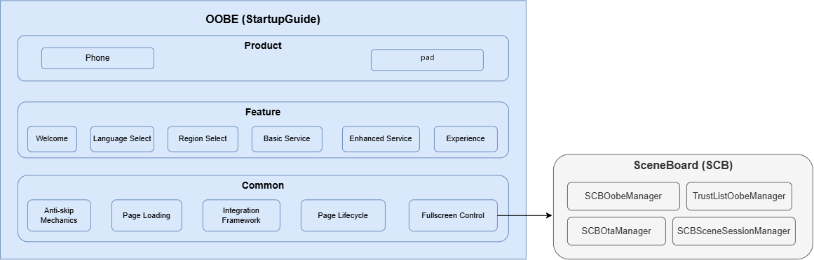
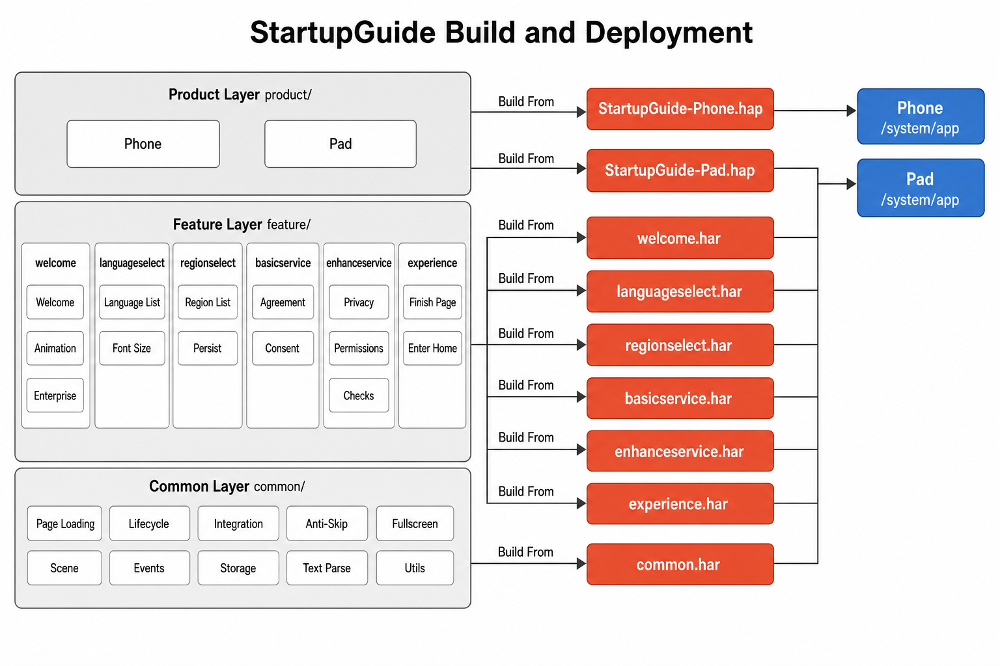

# StartupGuide

## Introduction
**StartupGuide** (bundle name: `com.ohos.startupguide`) is the **OOBE (Out Of Box Experience)** system application in the OpenHarmony standard system. It provides the initial setup guide flow for first boot, factory reset, and OTA upgrade scenarios.

This is a pre-installed system application and usually has no desktop icon. In SceneBoard mode, SceneBoard (`SCBOobeManager`) starts it explicitly by the agreed bundle name. After the guide completes, the device enters the system desktop.

### Core Capabilities

**Scene Recognition and Page Orchestration**
- Uses `SceneTypeManager` at startup to identify the current scene: `FIRST_BOOT_SCENE` (first boot / factory reset) or `OTA_SCENE` (simplified upgrade flow).
- The product-layer `PageOrderController` assembles the page-controller chain per scene and drives forward / back navigation across welcome, language, region, agreements, WLAN, Experience Now, and related steps.

**Multilingual and Screen Reader Support**
- The product module provides multiple locale resources covering Chinese and English.
- Supports right-to-left layout via `RTLUtil` and `i18n.isRTL()`.

**Agreement and Privacy Guidance**
- Basic service: End User License Agreement / basic service terms presentation and consent.
- Enhanced service: config-driven optional enhanced-service statement page; which agreements to display are configured via OOBE config files; agreement content is read from the corresponding business app's metadata; users toggle each item, and results are written to Settings.
**External Page Integration**
- Embeds external modules such as WLAN through `ExternalPageComponent` / `BaseExternalPageController`.
- Keeps navigation and back semantics consistent between internal Features and external Abilities.

> **Note**: This repository is the OOBE **application layer**. Desktop, WLAN, and similar full business flows are provided by SceneBoard and the corresponding system apps. This app orchestrates guide steps, persists user choices, and hands control back to the desktop when finished.

### Supported Guide Pages

| Page / PageKey | Module | Application-side handling |
| ---- | ------ | -------------- |
| WELCOME | welcome | Welcome page and enterprise-device related entries |
| LANGUAGE_SELECT | languageselect | Language selection and font-size adjustment |
| REGION_SELECT | regionselect | Country / region selection |
| BASIC_SERVICE | basicservice | Basic service terms / End User License Agreement |
| ENHANCED_SERVICE | enhanceservice | Config-driven optional enhanced-service statement page |
| WLAN_KEY | product/phone (external controller) | WLAN setup (external page) |
| EXPERIENCE_NOW | experience | Experience Now; finish the guide and enter desktop |

### Relationship Between StartupGuide and the System

StartupGuide depends on the system framework and multiple system apps. It does not implement the full desktop or WLAN businesses itself.

**Events and call relationships**:
1. When setup is required, SceneBoard (`SCBOobeManager`) starts this app's `GuideHomeAbility` using bundle name `com.ohos.startupguide`.
2. After scene recognition, page orchestration, and user interaction, this app persists settings through system interfaces, ends the guide, and returns to the desktop.
3. Steps such as WLAN are started through external page controllers that launch the corresponding system apps / Abilities, then return to the guide chain.

> Example of a typical first-boot flow:
> - SceneBoard starts `GuideHomeAbility`;
> - `SceneTypeManager` identifies `FIRST_BOOT_SCENE`, and `PageOrderController` assembles Welcome → Language → Region → Basic Service → Enhanced Service → WLAN → Experience Now;
> - After the last page, the device enters the system desktop.

## Architecture

StartupGuide uses a **Product - Feature - Common** three-layer architecture and works with SceneBoard, system Settings, and related components.

### Position in the System

StartupGuide sits in the application layer as a pre-installed system app for boot setup. SceneBoard starts it explicitly. During the guide it may call back into WLAN and other system capabilities, then enters the desktop when finished.



### Layered Design

StartupGuide is divided into a Product layer, a Feature layer, and a Common capability layer:

- **Product layer**: Organizes entry HAPs by device form factor; owns Ability lifecycle, scene page orchestration, form-factor UI customization, and multilingual resources.
- **Feature layer**: Abstracts guide steps such as welcome, language, region, and agreements into reusable HARs that different product forms can integrate as needed.
- **Common capability layer**: Provides cross-feature base capabilities such as page loading, page lifecycle, external-page integration, anti-skip, and fullscreen control; all product forms depend on this layer.

### Modular Design

StartupGuide’s modular design is described from bottom to top: Common capability layer, Feature layer, then Product layer.

#### 1. Common Capability Layer

Located in the `common` directory and packaged as `@ohos/startupguide.common`. It mainly contains base guide capabilities that must be integrated when packaging StartupGuide for different products, such as page orchestration, controller base classes, external Ability integration, window control, storage, and shared UI.

| Module | Path | Description |
| ---- | ---- | ---- |
| Page loading | `common/src/main/ets/manager/PageConfigManager.ets`<br>`common/src/main/ets/controller/BasePageOrderController.ets` | Parses `page_configs` and CCM config, merges the guide page order, builds the controller chain by `PageKey`, and supports next / previous / jump |
| Page lifecycle | `common/src/main/ets/controller/BasePageController.ets`<br>`common/src/main/ets/ability/AbstractGuideAbility.ets` | Single-page controller base (init, data load, `isNeedShow`, navigation); shared Guide Ability lifecycle and error handling |
| Integration framework | `common/src/main/ets/controller/BaseExternalPageController.ets`<br>`common/src/main/ets/manager/WantManager.ts` | Framework for embedding external system pages (such as WLAN), with NEXT / PRE / SUBPAGE / CRASH result codes and Want collaboration |
| Anti-skip | `common/src/main/ets/controller/BasePageOrderController.ets`<br>`common/src/main/ets/manager/FastCloneSceneManager.ets`<br>`common/src/main/ets/util/DeviceUtil.ets` | Filters non-displayable steps via `isNeedShow()`; supports forced-network skip policy and fast-clone page skipping |
| Fullscreen control | SCB policy layer: `scb-oobe/SCBOobeManager.ts`<br>`scb-oobe/BaseOobeManager.ts`<br>`scb-oobe/trustlist/TrustListOobeManager.ts`<br>OOBE execution layer: `common/src/main/ets/manager/WindowManager.ets`<br>`product/phone/src/main/ets/ability/GuideHomeAbility.ets` | **SCB policy layer**: `SCBOobeManager.isOobeActivated()` determines whether the system is in the OOBE phase, controlling when fullscreen control is enabled/disabled; `TrustListOobeManager.isTrustlistForWms()` whitelist filters which UIAbilities are allowed to display windows during OOBE; `BaseOobeManager.startOobe()` disables edge gestures and registers session-exception listener, `finishOobe()` restores gestures and unregisters the listener. **OOBE execution layer**: `WindowManager.setWindowLayoutFullScreen()` + `maximize()` for fullscreen maximize; `setWindowSystemBarEnable()` to control system bar visibility; `setHideNonSystemFloatingWindows()` to hide non-system floating windows to prevent overlay-based clickjacking; `GuideHomeAbility` keeps floating windows hidden while foreground, sets brightness to 1, disables window decor, restores floating windows on background — reducing malicious overlay诱导 risks |
| Scene management | `common/src/main/ets/manager/SceneTypeManager.ets` | Identifies first-boot, sub-user, and related guide scenes; drives different page chains and finish-time Settings writes |
| Event system | `common/src/main/ets/event/` | `EventEmitter` / `EventReceiver` / common events for decoupled page communication |
| Persistence | `common/src/main/ets/preferences/`<br>`common/src/main/ets/storage/` | Preferences and KV storage for language, region, agreement consent, and other guide results |
| Text parsing | `common/src/main/ets/textparse/` | HTML / bold / link rich-text parsing for agreements (strategy chain) |
| Shared UI components | `common/src/main/ets/component/` | Reusable Footer, title bar, rich text, Lottie, card grid, enter-home, and related components |
| Basic utilities | `common/src/main/ets/util/` | Logging, Want, Settings, config parsing, font size, finish-guide (`OOBEUtil`), and other helpers |

#### 2. Feature Layer

Located in the `feature` directory. It mainly contains reusable guide feature capabilities across products. Different product forms can choose which features to integrate at packaging time. Current features mainly include:

- **Basic guide features**: Welcome (`welcome`), language select (`languageselect`), region select (`regionselect`), Experience Now (`experience`), and so on.
- **Agreement and service features**: Basic service (`basicservice`), enhanced service (`enhanceservice`), OTA service statements (`otaservice`), and so on.

| Module | Path | Description |
| ---- | ---- | ---- |
| Welcome | `feature/welcome` | Welcome page layout and animation; enterprise-device offline trigger, and so on |
| Language select | `feature/languageselect` | Language list, language/region data models, font-size adjustment |
| Region select | `feature/regionselect` | Country/region list, persist selected region, region utilities |
| Basic service | `feature/basicservice` | Basic service terms / End User License Agreement presentation and consent; version-based show/hide |
| Enhanced service | `feature/enhanceservice` | Loads optional enhanced-service statement items from JSON; persists user toggles to Settings; includes privacy UIExtension component, permission dialog, OTA version filtering |
| Experience Now | `feature/experience` | Guide completion page; ends OOBE and enters the system desktop |

#### 3. Product Layer

Located in the `product` directory. It organizes entry HAPs for concrete device form factors. The current entry is the `phone` product form; forms such as `Pad` can be extended with the same layered approach. The product layer owns Ability entry, scene page-chain assembly, external page controllers, form-factor wrappers around Feature components, and multilingual resources.

| Module | Path | Description |
| ---- | ---- | ---- |
| AbilityStage | `product/phone/src/main/ets/Application/` | Application-level lifecycle entry |
| GuideHomeAbility | `product/phone/src/main/ets/ability/` | Guide main-window Ability; initializes orchestration, fullscreen/floating-window control, shipping-mode collaboration |
| Page orchestration | `product/phone/src/main/ets/controller/PageOrderController.ets` | Assembles the page-controller chain per scene: Welcome → Language → Region → Basic Service → Enhanced Service → WLAN → Experience Now |
| External page controllers | `product/phone/src/main/ets/controller/external/` | Integration and display control for external system pages such as WLAN |
| Main page / page models | `product/phone/src/main/ets/pages/`<br>`product/phone/src/main/ets/model/` | Guide main page, reboot notice page, page-switch model, and phone-form styles |
| Form-factor component wrappers | `product/phone/src/main/ets/components/` | Phone-form wrappers around Feature components; includes containers such as `ExternalPageComponent` |
| Multilingual resources | `product/phone/src/main/resources/` | Product-side multi-locale strings and media resources |

### Ability and UI Scenes

After the entry Ability starts and initializes the scene, `PageOrderController` launches Feature pages per scene, or embeds system pages through external controllers:

**Data flow overview**:

```text
SceneBoard (SCBOobeManager)
  → GuideHomeAbility
  → SceneTypeManager
  → PageOrderController
  → Feature PageController (welcome / language / ...)
  → Optional ExternalPageController (WLAN / ...)
  → ExperiencePageController
  → Enter system desktop
```

**First-boot flow:**

```text
Welcome → Language Select → Region Select → Basic Service → Enhanced Service → WLAN → [External Pages...] → Experience Now
```

### Components and External Dependencies

Internally the component is organized by product / feature / common capabilities. Cross-process collaboration depends on SceneBoard launch, Settings persistence, and external Abilities such as WLAN.

```text
product/phone (entry)
├── @ohos/startupguide.common
├── @ohos/startupguide.basicservice
├── @ohos/startupguide.enhanceservice
├── @ohos/startupguide.languageselect
├── @ohos/startupguide.experience
├── @ohos/startupguide.welcome ──────── (depends on languageselect)
├── @ohos/startupguide.regionselect
└── @ohos/startupguide.otaservice ──── (depends on enhanceservice + basicservice)
```

## Build

This project is a multi-module HAP application built with Hvigor. The entry module is `phone_startupguide`. The output is the `com.ohos.startupguide` system app package, deployed to `/system/app` on device.



Typical Release HAP path:

```text
product/phone/build/default/outputs/default/phone_startupguide-default-signed.hap
```

### Environment Requirements
- OpenHarmony SDK (this project uses `compileSdkVersion` 23 and `compatibleSdkVersion` / `targetSdkVersion` 20)
- DevEco Studio or the command-line Hvigor toolchain (prefer the DevEco-bundled node / hvigor / JBR)
- Node.js and the OHPM package manager
- System signing certificates (see `hw_sign/` / `signature/`)

### Build Commands

From the project root:

```bash
# 1. Install dependencies
ohpm install

# 2. Build HAP
hvigorw assembleHap

# 3. Run tests (optional)
hvigorw @ohos/hypium:test
```

Or use the CI/CD script:

```bash
sh build.sh
```

When integrating as an OpenHarmony system component in the source tree, follow the platform unified build flow and package this app as a pre-installed system application in the image.

### Key Dependencies

| Dependency | Version | Description |
| ---- | ---- | ---- |
| `@ohos/lottie` | 2.0.27 | Lottie animation library |
| `@ohos/hypium` | 1.0.21 | Test framework |

> Some HMS / AppGallery dependencies may be trimmed or commented out by product form. Use the actual product dependency list for integration.

## StartupGuide Development

StartupGuide is developed in **ArkTS**, with UI based on the ArkUI Stage model. The product layer owns Ability and page orchestration, the feature layer hosts each guide-step business, and the common layer provides shared base capabilities. Development reference: [ArkUI Development Overview](https://gitcode.com/openharmony/docs/blob/master/en/application-dev/ui/arkts-ui-development-overview.md)

### Development Based on Existing Modules

Typical scenarios: customize an existing guide step, such as adjusting page order, trimming a step, changing agreement interaction, or adjusting external-page integration.

**Adjusting or trimming existing modules**

1. Identify the change location by business boundary: `product/phone` (orchestration / form factor), `feature/*` (single-step business), or `common` (scene, base classes, utilities).
2. When adjusting page order or scenes:
    - Scene detection is in `common/.../manager/SceneTypeManager.ets`;
    - Page keys are in `common/.../constant/PageKey.ts`;
    - Scene page-chain assembly is in `product/phone/.../controller/PageOrderController.ets`.
3. When trimming a guide step:
    - First remove the `PageKey` from the corresponding scene Map in `PageOrderController`;
    - Then confirm there are no leftover jumps, analytics, or test dependencies that would break the chain.

For example, the first-boot page chain is registered as follows (from `PageOrderController.ets`). To trim a step, remove the corresponding `mControllerMap.set(...)` call:

```typescript
// product/phone/src/main/ets/controller/PageOrderController.ets
private initFirstBootSceneMap(): void {
  let firstController: BasePageController = new WelcomePageController(this, PageKey.WELCOME);
  FirstDefaultPageManager.getInstance().setDefaultFirstPage(PageKey.WELCOME, firstController);
  this.mControllerMap.set(PageKey.WELCOME, firstController);
  this.mControllerMap.set(PageKey.LANGUAGE_SELECT, new LanguageSelectPageController(this));
  this.mControllerMap.set(PageKey.REGION_SELECT, new RegionSelectPageController(this));
  this.mControllerMap.set(PageKey.BASIC_SERVICE, new BasicServicePageController(this));
  this.mControllerMap.set(PageKey.ENHANCED_SERVICE, new EnhanceServicePageController(this));
  this.mControllerMap.set(PageKey.WLAN_KEY, new WlanPageController(this));
  this.mControllerMap.set(PageKey.EXPERIENCE_NOW, new ExperiencePageController(this));
}
```

Whether an external page is shown is decided by overriding `isNeedShow()`. WLAN example (from `WlanPageController.ets`):

```typescript
// product/phone/src/main/ets/controller/external/WlanPageController.ets
export class WlanPageController extends BaseExternalPageController {
  public constructor(pageOrderController: IPageOrderController) {
    super(pageOrderController, PageKey.WLAN_KEY);
  }

  isNeedShow(): boolean {
    if (FastCloneSceneManager.getInstance().isCloneWlan()) {
      let isNetConnected: boolean = InternetManager.getInstance().isNetConnected();
      return super.isNeedShow() && !isNetConnected;
    }
    return super.isNeedShow();
  }
}
```

**Modifying existing UI**

Example: customize the first-boot welcome page UI:
- Application entry is `GuideHomeAbility`; page orchestration is `PageOrderController`.
- The feature layer provides page controllers and reusable business components; the product layer may wrap form-factor customization under `product/phone/src/main/ets/components/`.
- Prefer extending inside the corresponding Feature; avoid leaking product-form differences into Common.

Product-side welcome page wrapper example (from `WelcomeComponent.ets`), composing Feature `WelcomeComp` and handling Continue:

```typescript
// product/phone/src/main/ets/components/welcome/WelcomeComponent.ets
@Builder
export function WelcomeComponentLoader($$: IPageController | null | undefined): void {
  WelcomeComponent({ mPageController: $$ as WelcomePageController });
}

@Component
export struct WelcomeComponent {
  protected mPageController: WelcomePageController | null = null;

  build() {
    WelcomeComp({
      firstSrcPath: '',
      secondSrcPath: '',
      yHeight: '86.0%',
      isAutoPlaySecond: false,
      accessibilityReadingText: ResourceUtil.getStringByResource($r('app.string.continue')),
      buttonOnClick: () => {
        if (!StringUtil.isFastClick()) {
          this.mPageController?.handleNextButtonClick();
        }
      }
    })
  }
}
```

Common modification entry points:

| Target | Path |
| ---- | ---- |
| Scene recognition | `common/src/main/ets/manager/SceneTypeManager.ets` |
| Page keys | `common/src/main/ets/constant/PageKey.ts` |
| Page orchestration | `product/phone/src/main/ets/controller/PageOrderController.ets` |
| Welcome / language / region business | `feature/<module>/` |
| External pages (such as WLAN) | `product/phone/src/main/ets/controller/external/` |
| Product-form component wrappers | `product/phone/src/main/ets/components/` |

### Developing New Features or Guide Steps

Typical scenarios: add a guide page, extend a device form factor, or integrate an additional external system page.

> **Note**: The current project uses `product/phone` as the entry HAP, with Features reused as HARs. Prefer placing new capabilities in an independent Feature HAR. Sink to `common` only when the capability must be shared across Features.

**Step 1: Extend page orchestration (most common)**

1. Add the new page key in `PageKey.ts` (skip if it already exists):

```typescript
// common/src/main/ets/constant/PageKey.ts
export enum PageKey {
  WELCOME = 'welcome',
  LANGUAGE_SELECT = 'language_select',
  REGION_SELECT = 'region_select',
  BASIC_SERVICE = 'basic_service_statement',
  ENHANCED_SERVICE = 'enhanced_service_statement',
  EXPERIENCE_NOW = 'experience',
  WLAN_KEY = 'wlan',
  // Example of a new page key:
  // MY_NEW_PAGE = 'my_new_page',
}
```

2. Add or extend the corresponding HAR under `feature/` (Controller + Component + Model). Feature controllers usually extend `BasePageController`, for example the welcome page:

```typescript
// feature/welcome/src/main/ets/controller/WelcomePageController.ets
export class WelcomePageController extends BasePageController {
  public constructor(pageOrderController: IPageOrderController, controllerKey: PageKey) {
    super(pageOrderController, controllerKey);
  }
}
```

3. Register the controller in the scene Map in `PageOrderController` (see `initFirstBootSceneMap` above).
4. For an external system page, extend `BaseExternalPageController` and register it in the product layer (see `WlanPageController` above).
5. Add matching DT cases under `product/phone/src/ohosTest`.

**Step 2: Configure / confirm the Ability entry**

The project entry is already declared in `product/phone/src/main/module.json5`. In SceneBoard mode, do not register `entity.system.home` / `action.system.home`, or this app may occupy the boot home slot. When extending capabilities, usually only confirm that permissions, `deviceTypes`, and Ability configuration match the new scenario:

```json
{
  "module": {
    "name": "phone_startupguide",
    "type": "entry",
    "srcEntrance": "./ets/Application/AbilityStage.ets",
    "mainElement": "com.ohos.startupguide.MainAbility",
    "deviceTypes": [
      "default"
    ],
    "abilities": [
      {
        "name": "com.ohos.startupguide.MainAbility",
        "srcEntry": "./ets/ability/GuideHomeAbility.ets",
        "visible": false
      }
    ]
  }
}
```

The entry Ability initializes page orchestration and loads the guide main page when the window is created (from `GuideHomeAbility.ets`):

```typescript
// product/phone/src/main/ets/ability/GuideHomeAbility.ets
export default class GuideHomeAbility extends AbstractGuideAbility {
  onWindowStageCreate(windowStage: window.WindowStage): void {
    Promise.all([
      PageOrderController.getInstance().init(() => {
        ExperienceManager.getInstance().setLightModeOnRestart();
      }),
      mediaConfigManager.initMediaConfig(),
      pageLayoutManager.initPageLayoutConfig()
    ]).finally(() => {
      this.loadContent(windowStage, 'pages/Page');
    });
    WindowManager.getInstance().registerWindowStage(windowStage);
  }

  loadWindowStage(windowStage: window.WindowStage, pageUrl: string) {
    windowStage?.loadContent(pageUrl).then(() => {
      windowStage.getMainWindow().then((mainWindow) => {
        mainWindow.setWindowBrightness(1);
        WindowManager.getInstance().setWindowLayoutFullScreen(true);
        WindowManager.getInstance().setHideNonSystemFloatingWindows(true);
        windowStage.disableWindowDecor();
      });
    });
  }
}
```

**Step 3: Customize UI**

After page registration and orchestration, extend the corresponding Feature components as described in “Modifying existing UI”.

To add an independent page:
1. Add the page / component under the corresponding `feature/<module>/` or `product/phone/src/main/ets/pages/`;
2. Register it in `resources/base/profile/main_pages.json` when needed;
3. Launch it from `PageOrderController` by `PageKey`.

## Directory
```text
StartupGuide
├─AppScope                              # App-level config and icon resources
│  ├─app.json5                          # bundleName, version, and so on
│  └─resources/                         # App-level resources
├─common                                # Common layer - shared base library
│  └─src/main/ets/
│     ├─ability/                        # Base Ability classes
│     ├─component/                      # Reusable UI components
│     ├─constant/                       # PageKey, CommonConstant, and so on
│     ├─context/                        # GlobalContext, RealContext
│     ├─controller/                     # Page / external-page base controllers
│     ├─event/                          # EventEmitter / EventReceiver
│     ├─manager/                        # Scene, shipping-mode, and other managers
│     ├─model/                          # Shared data models
│     ├─preferences/                    # Preferences storage
│     ├─storage/                        # KV storage
│     ├─textparse/                      # HTML / bold / link parsing
│     └─util/                           # Utility classes
├─feature                               # Feature layer - independent feature HARs
│  ├─basicservice/                      # Basic service / user agreement
│  ├─enhanceservice/                    # Enhanced service
│  ├─experience/                        # Experience Now
│  ├─languageselect/                    # Language selection
│  ├─otaservice/                        # OTA service declaration
│  ├─regionselect/                      # Country / region selection
│  └─welcome/                           # Welcome page / enterprise device
├─product                               # Product layer - device-form entry
│  └─phone/                             # Phone product form (entry HAP)
│     ├─src/main/ets/                   # Ability, orchestration, external controllers, form components
│     ├─src/main/resources/             # Multilingual resources
│     └─src/ohosTest/                   # Hypium DT tests
├─hvigor                                # Build toolchain config
├─hw_sign / signature                   # Signing certificates and profile
├─build-profile.json5                   # Project-level SDK / signing / modules config
├─build.sh                              # CI/CD build script
├─hvigorfile.ts                         # Hvigor build entry
├─oh-package.json5
├─OAT.xml                               # Open-source compliance audit
├─LICENSE
├─README.md
└─README_en.md
```

## Constraints
- Language: ArkTS
- Runtime form: pre-installed system application (`com.ohos.startupguide`), depending on privileged system permissions and explicit SceneBoard launch
- Device types: current entry module `deviceTypes` is `default` (see `product/phone/src/main/module.json5`)
- SDK: `compileSdkVersion` 23, `compatibleSdkVersion` / `targetSdkVersion` 20; app `minAPIVersion` 11, `targetAPIVersion` 12
- SceneBoard mode: do not register this app as the system home (`entity.system.home`), or it may occupy the boot home slot
- Privileged permissions required by a system app must not be removed solely under a “least privilege” rule; verify real scenarios, `usedScene`, callers, and pre-install identity
- This repository does not include SceneBoard / WLAN system-app source; external steps collaborate through controllers and IPC / Ability launch

## Contributing

Contributions of code and documentation are welcome. For the contribution process, see [Contribute](https://gitcode.com/openharmony/docs/blob/master/en/contribute/contribution-process.md).
